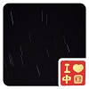

# 荣誉墙

**感谢以下小伙伴对本项目做出的贡献(排名不分先后)！**

|  社区头像 | 社区 ID     | 个人简介 |
| :---------------------------------: | :--------------------------------------------------: |:--: |
|       | [liuduanfei](https://github.com/liuduanfei)          | 社区开源爱好者。[art_pi_net_player](https://github.com/RT-Thread-Studio/sdk-bsp-stm32h750-realthread-artpi/tree/master/projects/art_pi_net_player) 作者之一,提交多个软件包 |
|         | [loogg](https://github.com/loogg)                    |社区开源爱好者。[industry_io_gateway](https://github.com/RT-Thread-Studio/sdk-bsp-stm32h750-realthread-artpi/tree/master/projects/industry_io_gateway)，**agile**系列软件包，**libmodbus**软件包作者|
|                | [Aladdin Wang](https://blog.csdn.net/sinat_31039061) |社区开源爱好者。撰写 [《玩转 ART-Pi 系列教程》](https://blog.csdn.net/sinat_31039061/category_10389752.html); TOUCHGFX 软件包作者。|
|      | [WKJay](https://github.com/WKJay/)                   |社区开源爱好者。[art_pi_factory](https://github.com/RT-Thread-Studio/sdk-bsp-stm32h750-realthread-artpi/tree/master/projects/art_pi_factory)作者之一，并提交多个软件包|
|  | [Forest-Rain](https://github.com/Forest-Rain)        |社区开源爱好者，LORAWAN 小组成员。LORA 扩展模块，LORA 工程作者。提交多个无线模块相关的软件包。|
|     | [zylx](https://github.com/qgyhd1234)                 |社区开源爱好者。[art_pi_net_player](https://github.com/RT-Thread-Studio/sdk-bsp-stm32h750-realthread-artpi/tree/master/projects/art_pi_net_player)作者之一。|
|    | [supperMCU](https://github.com/supperthomas) |2020 RTT 社区卓越贡献者。[art_pi_net_player](https://github.com/RT-Thread-Studio/sdk-bsp-stm32h750-realthread-artpi/tree/master/projects/art_pi_net_player)作者之一。提交多个软件包，带领蓝牙小组工作，协助他人提交代码。|
|  | [Dozingfiretruck](https://gitee.com/Dozingfiretruck) |社区开源爱好者。IOT 扩展模块，IOT 工程作者。 [ART_PI_IOT扩展板开源地址](https://gitee.com/Dozingfiretruck/art_pi_iot)|
|  | 李平 |社区开源爱好者。ART-PI-DOCK扩展板作者。|
|  | [攻城狮晨哲](https://oshwhub.com/CYIIOT) |社区开源爱好者。OSHWHub-[ART-PI开源硬件社区](https://oshwhub.com/ART-Pi-kai-yuan-kuo-zhan-ban)超管|
|  | 李子木 | 社区开源爱好者。 |
|  | layson.li | |
|  | Embedded 小飞哥  |社区开源爱好者。[ART-PI软件包调试系列教程](https://mp.csdn.net/editor/html/110261428)，乐于分享调试经验。|
|  | Sakura ||
|  | 你好我叫 刘大大 ||
|  | 杨澄|社区开源爱好者。喜欢写博客，写了一些ART-Pi的相关文章。[《ART-Pi入坑系列》](https://blog.csdn.net/m0_37697335/category_10484125.html)|
|  | Ouxiaolong|社区开源爱好者。撰写 [《玩转ART-Pi开发板》](https://blog.csdn.net/bruceoxl/category_10642929.html)。|
|  | ᥬ Z_Tam ᭄ ||
|  | [iysheng](https://github.com/iysheng) |社區開源愛好者。[RedClock](https://gitee.com/iysheng/redclock) 墨水屏擴展板開發者|
|  | [RudyLo](https://github.com/luhuadong) |2020 RTT 社区卓越贡献者。[CSDN 博客专家](https://blog.csdn.net/lu_embedded)，[《开源指北》](https://gitee.com/gitee-community/opensource-guide)作者之一，开源爱好者，零废弃生活倡导者。|
|  | LZS||
|  | 水寒 ||
|  | cc-caixf ||
|  | [mchoose](https://gitee.com/mtos) ||
|  | 崔可 ||
|  | 飘雪冰峰 ||
|  | adaphoto ||
