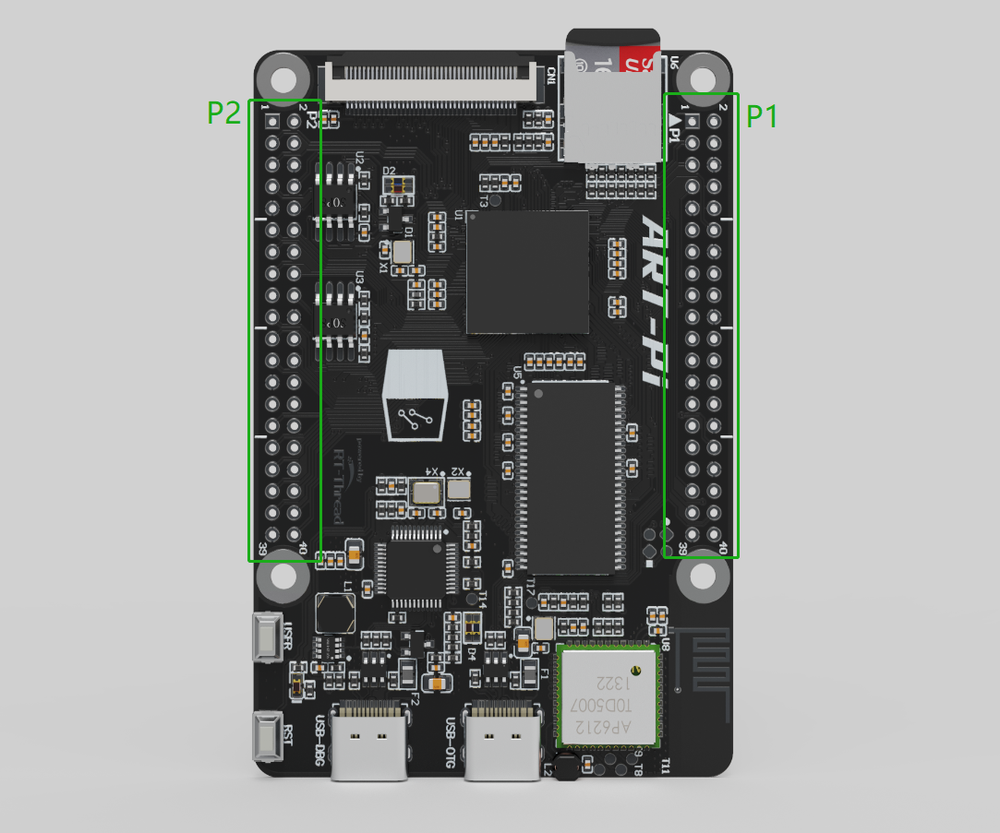
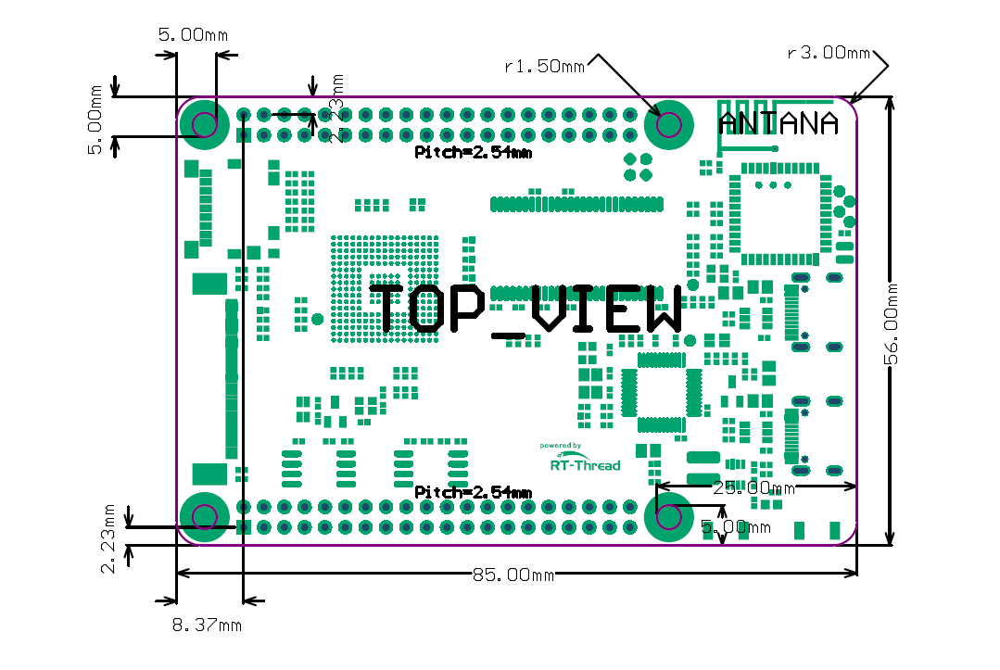
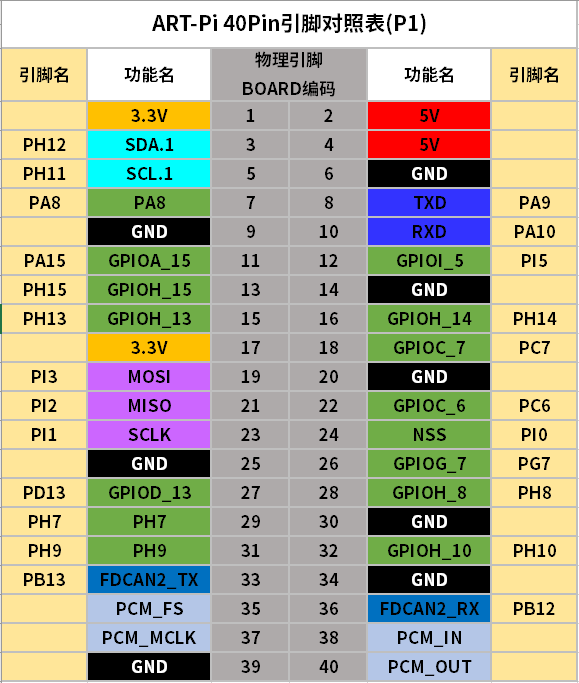
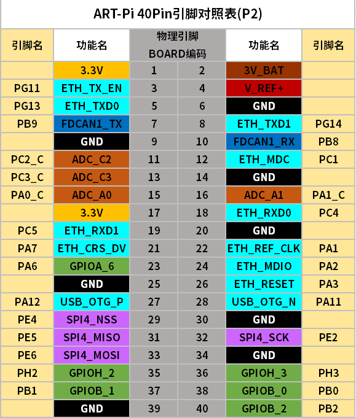

# RT-Thread 开源硬件 ART-Pi 引脚扩展说明

## ART-Pi 图片展示

## ART-Pi 机械尺寸图示

## ART-Pi 扩展引脚图示

ART-Pi 的 P1 排针扩展引脚，与树莓派是兼容的，并且在树莓派原有基础上，还增加了 FDCAN 复用功能。实际上ART-Pi 很多 IO 复用功能并未列出，开发者可按需对照芯片的数据手册去查表使用。感兴趣的小伙伴可以按照上面给出的机械图和扩展管脚列表，开始自己的 ART-Pi DIY 之旅了。