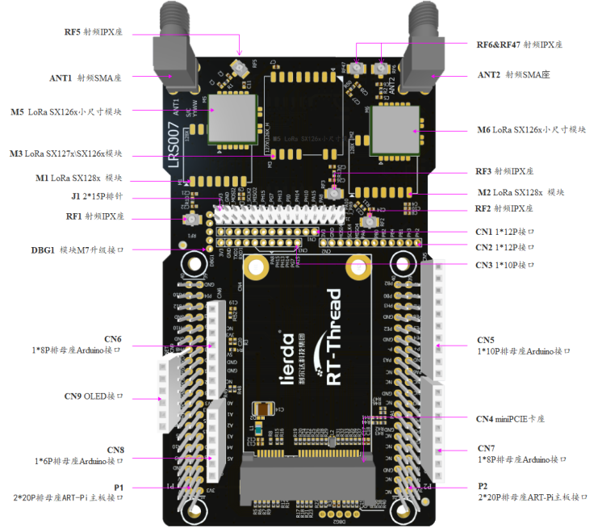
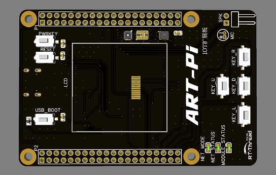
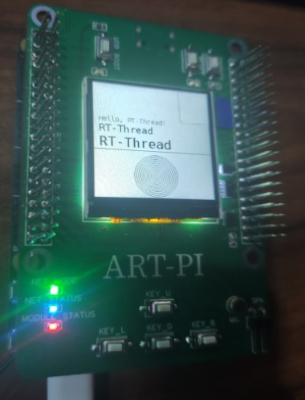
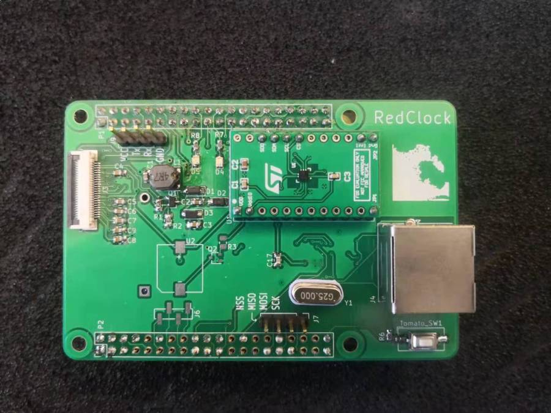
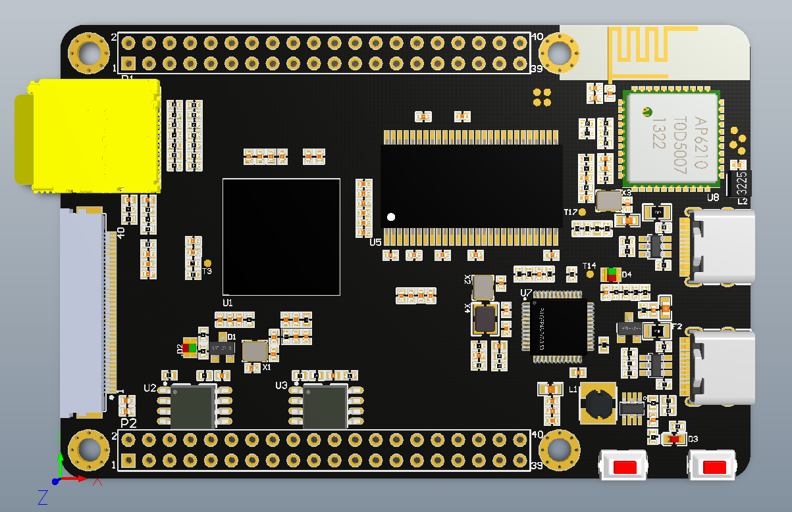

# 扩展板分享
## LoRa多功能扩展板(LRS007)

|   作者   |               [lierda](http://wsn.lierda.com/)               |
| :------: | :----------------------------------------------------------: |
| 仓库地址 |                             todo                             |
| 硬件信息 | 支持lora 126x 127x 128x 1302支持470M频段、868~915频道，2.4G频段；  支持lora设备 单\双\8通道网关； |

## IOT扩展板

| 作者     | [**Dozingfiretruck**](https://gitee.com/Dozingfiretruck) |
| -------- | -------------------------------------------------------- |
| 仓库地址 | https://gitee.com/Dozingfiretruck/art_pi_iot             |
| 硬件信息 |                                                          |

## 野火 RGB 显示屏转接板

| 作者     | [layson](https://gitee.com/layson_li)                      |
| -------- | ---------------------------------------------------------- |
| 仓库地址 | https://gitee.com/layson_li/art-pi-open-source-information |
| 硬件信息 |                                                            |

- ## 亚克力外壳

  

  
|   作者   | [mchoose](https://gitee.com/mtos) |
| :------: | :-------------------------------: |
| 仓库地址 |   https://gitee.com/mtos/art-pi   |
| 硬件信息 |                                   |

## Ink screen 多功能扩展板

|   作者   |               [iysheng](https://gitee.com/iysheng)           |
| :------: | :----------------------------------------------------------: |
| 仓库地址 |    [RedClock](https://gitee.com/iysheng/redclock)            |
| 硬件信息 | spi 墨水屏接口、ETH、LPS22HH 傳感器                          |

## 复制官方 ART-Pi

|   作者   | [通宵敲代码](https://gitee.com/knocking_code_all_night_admin) |
| :------: | :----------------------------------------------------------: |
| 仓库地址 | [ART-Pi_STM32H750_COPY](https://gitee.com/knocking_code_all_night_admin/ART-Pi_STM32H750_COPY) |
| 硬件信息 |                                                              |

## 多媒体扩展板

| 作者     |                     RT-Thread                     |
| -------- | :-----------------------------------------------: |
| 硬件信息 | SPI-LCD, TOUCH(FT6236), WM8988, DCMI接口,背光调节 |

## 工业扩展板

|   作者   |                RT-Thread                 |
| :------: | :--------------------------------------: |
| 硬件信息 | ETH, RS-232, RS-485, CAN, USB-HOST, BEEP |