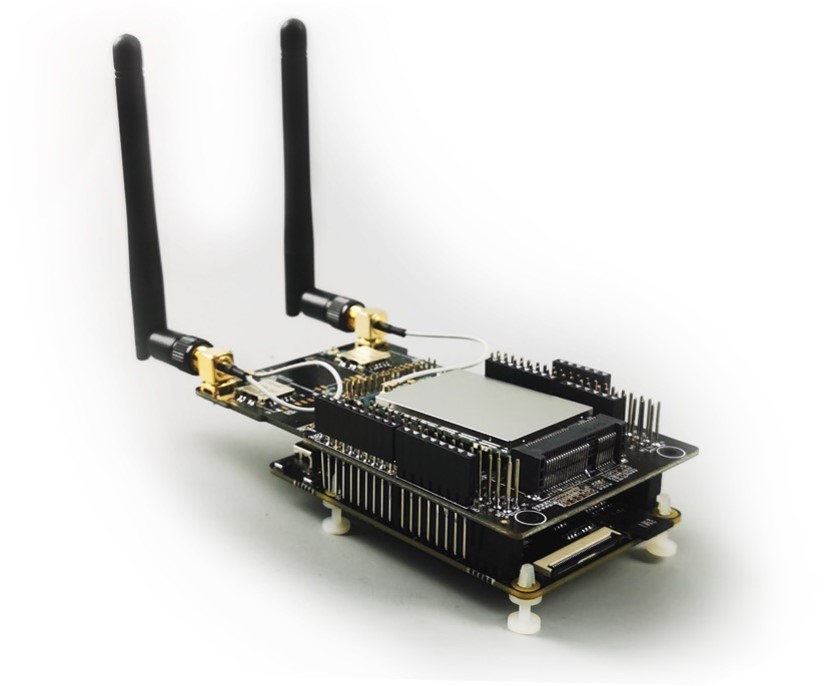
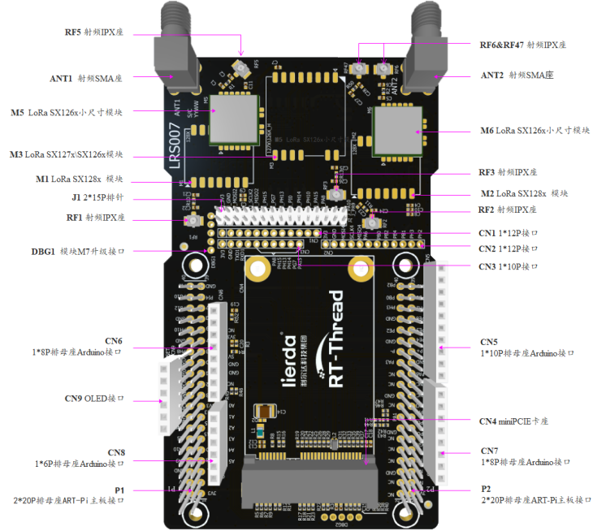
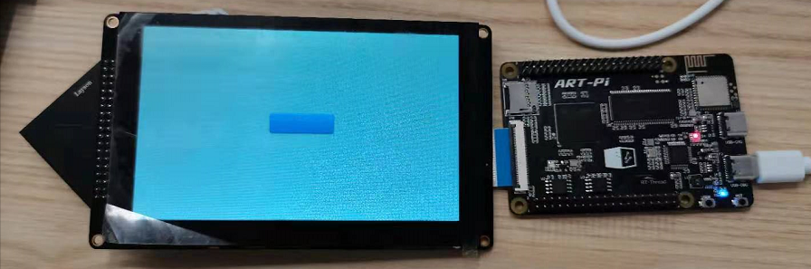
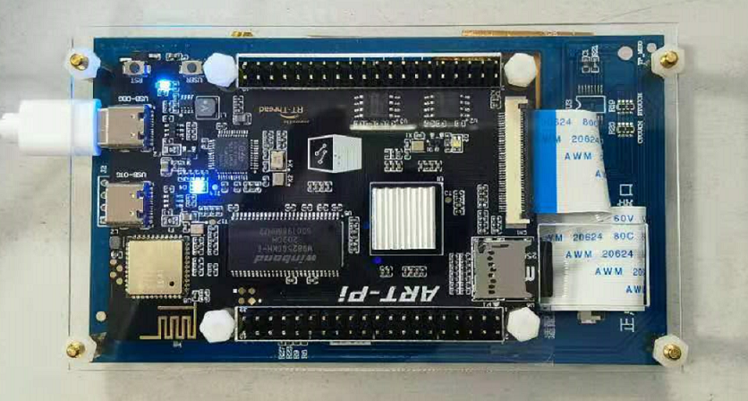
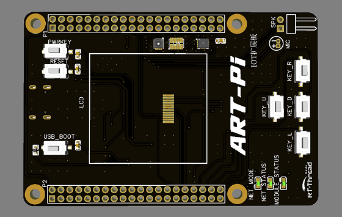
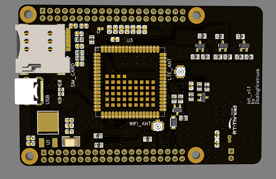

# Demo 分享

## 掌上游戏机

<iframe src="https://player.bilibili.com/player.html?aid=970600404&bvid=BV1Sp4y1z7eB&cid=263208751&page=1" scrolling="no"  height="320px"   border="0" frameborder="no" framespacing="0"  style="width:auto;min-width:auto" allowfullscreen="true"> </iframe>

- 作者：Sakura
- 仓库地址：todo

## 云音乐播放器

<iframe src="https://player.bilibili.com/player.html?aid=203075053&bvid=BV1oa411F7wp&cid=263210345&page=1" scrolling="no"  height="320px"   border="0" frameborder="no" framespacing="0"  style="width:auto;min-width:auto" allowfullscreen="true"> </iframe>

- 作者：[liuduanfei](https://github.com/liuduanfei)
- 仓库地址：https://github.com/RT-Thread-Studio/sdk-bsp-stm32h750-realthread-artpi/tree/master/projects/art_pi_net_player

## 互联网网关

- 作者：[loogg](https://github.com/loogg)
- 仓库地址：https://github.com/RT-Thread-Studio/sdk-bsp-stm32h750-realthread-artpi/tree/master/projects/industry_io_gateway

# 扩展板分享
## LoRa多功能扩展板(LRS007)

LoRa多功能扩展板 全功能版

- 作者：[lierda](http://wsn.lierda.com/)
- 主页：todo
- 仓库地址：todo
- 
## 野火 RGB 显示屏转接板

- 作者：[layson](https://gitee.com/layson_li)

- 仓库地址：https://gitee.com/layson_li/art-pi-open-source-information

  

- ## 亚克力外壳

  

  - 作者：[mchoose](https://gitee.com/mtos)
  - 仓库地址：https://gitee.com/mtos/art-pi

## 多媒体扩展板

- 作者：RT-Thread
- 主页：todo
- 仓库地址：todo

## 工业扩展板

- 作者：RT-Thread
- 主页：todo
- 仓库地址：todo

## IOT扩展板

- 作者：[**Dozingfiretruck**](https://gitee.com/Dozingfiretruck)
- 仓库地址：[ **[ART_PI_IOT扩展板开源项目]**](https://gitee.com/Dozingfiretruck/art_pi_iot)

